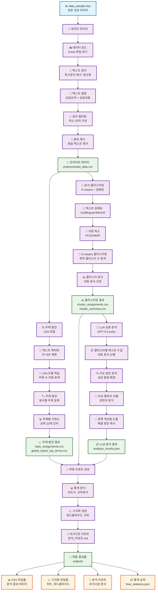
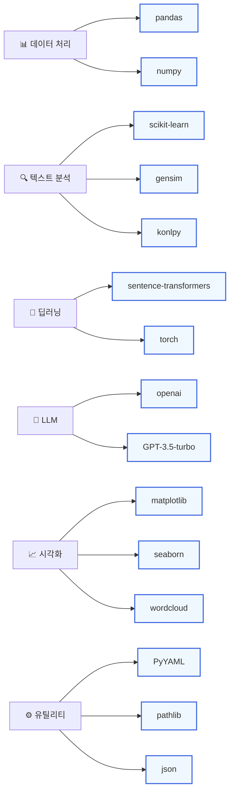

# 대규모 상담/게시판 데이터 주제 발견 및 심층 분석 파이프라인

## 전체 분석 과정 다이어그램



## 상세 분석 단계별 설명

### 1. 🔧 데이터 전처리 단계
- **입력**: `data_sample.xlsx` (원본 상담 데이터)
- **처리 과정**:
  - 텍스트 정리 (특수문자, 불용어 제거)
  - 텍스트 결합 (상담요약 + 상담내용)
  - 길이 필터링 (최소 20자)
  - 중복 제거
- **출력**: `preprocessed_data.csv`

### 2. 🔍 주제 발견 단계
- **입력**: 전처리된 텍스트 데이터
- **처리 과정**:
  - TF-IDF 벡터화
  - LDA 모델 학습 (주제 수 자동 탐색)
  - 문서별 주제 할당
  - 주제별 키워드 추출
- **출력**: `topic_assignments.csv`, `global_topics_top_terms.csv`

### 3. 🎯 문서 클러스터링 단계
- **입력**: 전처리된 텍스트 데이터
- **처리 과정**:
  - 다국어 임베딩 생성 (multilingual-MiniLM)
  - 차원 축소 (PCA/UMAP)
  - K-means 클러스터링 (최적 클러스터 수 탐색)
  - 클러스터별 대표 문서 선정
- **출력**: `cluster_assignments.csv`, `cluster_summary.csv`

### 4. 🤖 LLM 심층 분석 단계
- **입력**: 클러스터링 결과
- **처리 과정**:
  - 클러스터별 대표 텍스트 수집
  - GPT-3.5-turbo를 통한 심층 분석
  - 주요 원인, 행위자, 정책 개선점 도출
- **출력**: `analysis_results.json`

### 5. 📄 최종 리포트 생성 단계
- **입력**: 모든 분석 결과
- **처리 과정**:
  - 통계 분석 및 교차분석
  - 시각화 생성 (워드클라우드, 차트)
  - 마크다운 리포트 생성
- **출력**: `분석_리포트.md`, 시각화 파일들

## 기술 스택



## 출력 결과물 구조

```
outputs/
├── csv/
│   ├── preprocessed_data.csv          # 전처리된 데이터
│   ├── topic_assignments.csv          # 주제 할당 결과
│   ├── global_topics_top_terms.csv    # 주제별 키워드
│   ├── cluster_assignments.csv        # 클러스터 할당 결과
│   ├── cluster_summary.csv            # 클러스터 요약
│   └── analysis_results.json          # LLM 분석 결과
├── visualizations/
│   ├── wordclouds/                    # 워드클라우드
│   ├── frequency_charts/              # 빈도수 차트
│   └── cluster_distribution.png       # 클러스터 분포
└── reports/
    ├── 분석_리포트.md                  # 최종 분석 리포트
    └── final_statistics.json          # 통계 요약
```

## 실행 방법

```bash
# 전체 파이프라인 실행
python run_all.py

# 개별 단계 실행
python run_01_data_preprocessing.py    # 데이터 전처리
python run_02_topic_discovery.py       # 주제 발견
python run_03_clustering.py            # 클러스터링
python run_04_llm_analysis.py          # LLM 분석
python run_05_report_generation.py     # 리포트 생성
``` 