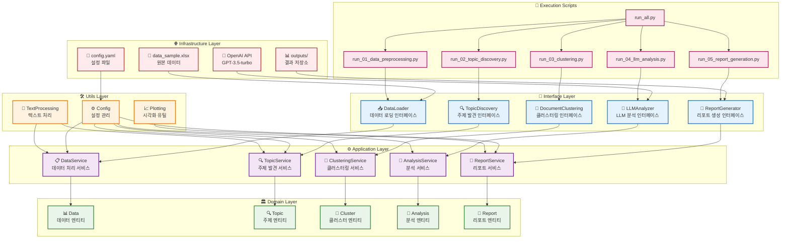
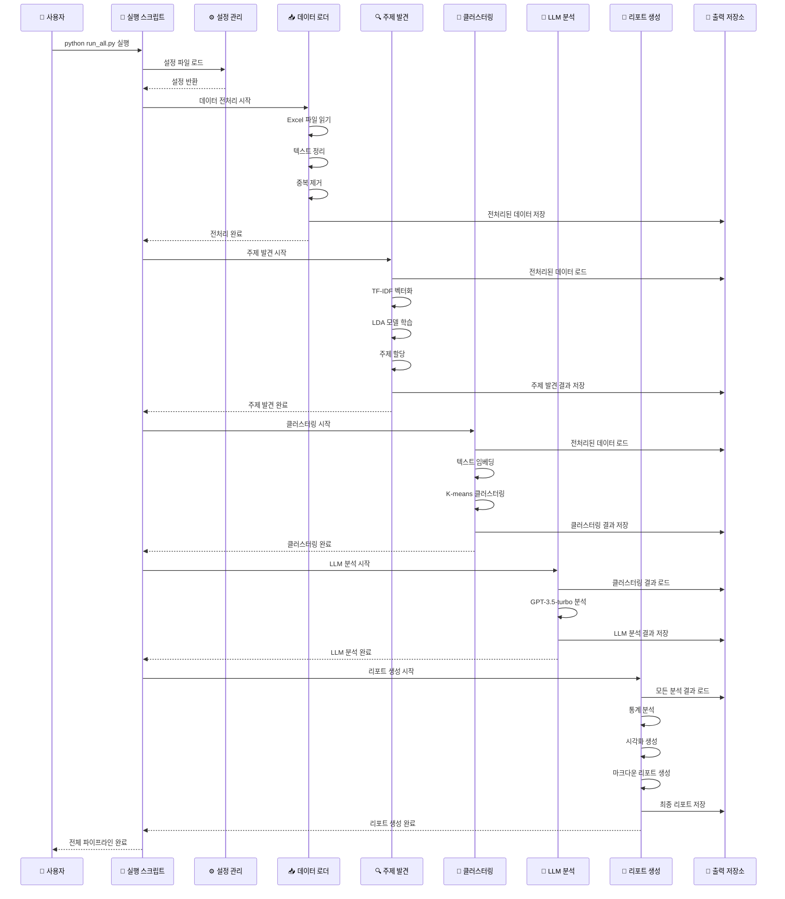
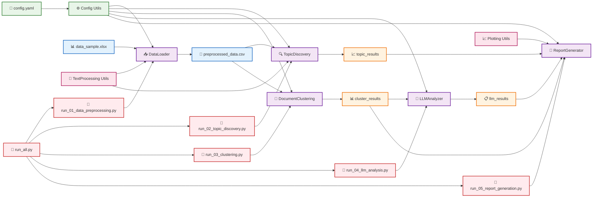

# Clean Architecture 구조 다이어그램

## 프로젝트 아키텍처

## 디렉토리 구조

```mermaid
graph TD
    A[📁 Bulletin_board_analysis/] --> B[📁 src/]
    A --> C[📁 outputs/]
    A --> D[📄 run_*.py]
    A --> E[📄 config.yaml]
    A --> F[📄 data_sample.xlsx]
    
    B --> B1[📁 ingest/]
    B --> B2[📁 topics/]
    B --> B3[📁 cluster/]
    B --> B4[📁 llm/]
    B --> B5[📁 report/]
    B --> B6[📁 utils/]
    B --> B7[📁 analysis/]
    
    B1 --> B1A[📄 data_loader.py]
    B2 --> B2A[📄 topic_discovery.py]
    B3 --> B3A[📄 document_clustering.py]
    B4 --> B4A[📄 llm_analyzer.py]
    B5 --> B5A[📄 report_generator.py]
    B6 --> B6A[📄 config.py]
    B6 --> B6B[📄 plotting.py]
    B6 --> B6C[📄 text_processing.py]
    B7 --> B7A[📄 cross_analysis.py]
    B7 --> B7B[📄 policy_insights.py]
    
    C --> C1[📁 csv/]
    C --> C2[📁 visualizations/]
    C --> C3[📁 reports/]
    
    D --> D1[📄 run_01_data_preprocessing.py]
    D --> D2[📄 run_02_topic_discovery.py]
    D --> D3[📄 run_03_clustering.py]
    D --> D4[📄 run_04_llm_analysis.py]
    D --> D5[📄 run_05_report_generation.py]
    D --> D6[📄 run_all.py]
    
    classDef rootStyle fill:#e8f5e8,stroke:#2e7d32,stroke-width:3px
    classDef srcStyle fill:#e3f2fd,stroke:#1565c0,stroke-width:2px
    classDef outputStyle fill:#fff3e0,stroke:#ef6c00,stroke-width:2px
    classDef scriptStyle fill:#fce4ec,stroke:#ad1457,stroke-width:2px
    classDef configStyle fill:#f3e5f5,stroke:#6a1b9a,stroke-width:2px
    
    class A rootStyle
    class B,B1,B2,B3,B4,B5,B6,B7,B1A,B2A,B3A,B4A,B5A,B6A,B6B,B6C,B7A,B7B srcStyle
    class C,C1,C2,C3 outputStyle
    class D,D1,D2,D3,D4,D5,D6 scriptStyle
    class E,F configStyle
```

## 데이터 흐름 다이어그램

## 의존성 관계

## 주요 특징

### 🏗️ **Clean Architecture 원칙**
- **의존성 역전**: 고수준 모듈이 저수준 모듈에 의존하지 않음
- **관심사 분리**: 각 레이어가 명확한 책임을 가짐
- **테스트 용이성**: 각 컴포넌트를 독립적으로 테스트 가능

### 🔄 **데이터 흐름**
1. **입력**: `data_sample.xlsx` → `DataLoader`
2. **처리**: 각 분석 모듈이 순차적으로 실행
3. **출력**: `outputs/` 디렉토리에 구조화된 결과 저장

### 🛠️ **확장성**
- 새로운 분석 모듈 추가 용이
- 설정 기반 동작으로 유연성 확보
- 모듈화된 구조로 유지보수 편의성

### 📊 **결과물**
- CSV 파일: 구조화된 데이터
- 시각화: 차트, 워드클라우드
- 리포트: 마크다운 문서
- 통계: JSON 형태의 요약 정보 